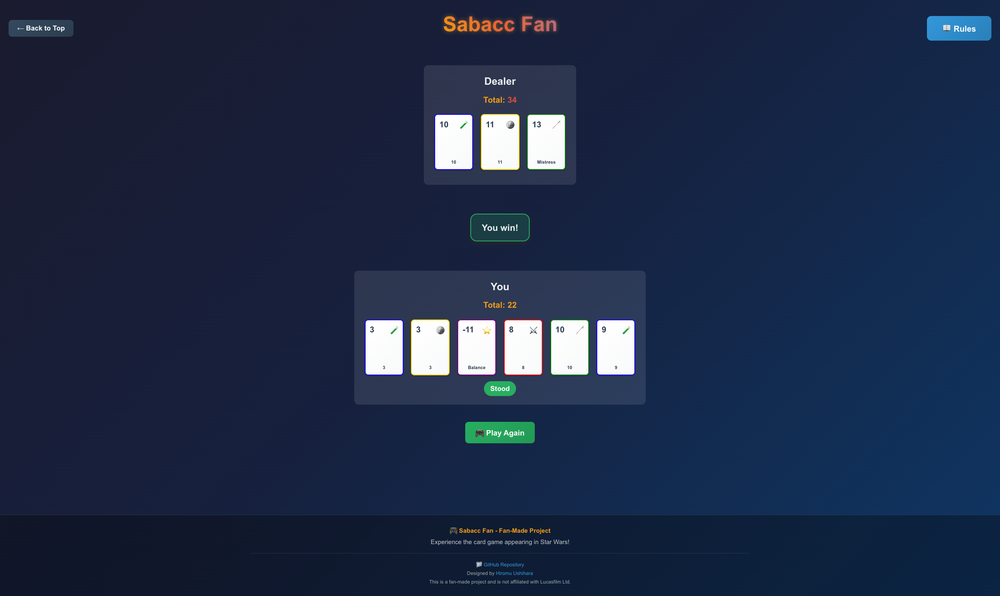

# Sabacc Fan

A fan-made web application implementing the card game "Sabacc" from Star Wars using React + TypeScript.





## Game Overview

[Sabacc](https://starwars.fandom.com/wiki/Sabacc) is a card game where players compete against a dealer (CPU). The goal is to get your hand total close to 23 or -23.

### Card Composition
- **Standard Cards (60 cards)**: 4 suits (Flasks, Sabers, Staves, Coins) with 15 cards each
- **Special Cards (16 cards)**: 8 types of cards with 2 cards each

### Game Rules
1. **Initial Hand**: Each player receives 2 cards
2. **Turn-based**: Players and dealer take turns
3. **Actions**:
   - **Draw**: Draw 1 card (maximum 5 cards)
   - **Exchange**: Exchange 1 card from hand with the top card from deck
   - **Stand**: Finalize your hand
   - **Lock**: Protect 1 card from Sabacc Shift

### Special Victory Conditions
- **Idiot's Array**: The Idiot + 2 + 3 → Instant victory
- **Pure Sabacc**: Total of 23 or -23 → Special victory
- **Bomb Out**: Total of 24 or higher, or -24 or lower → Instant defeat

### Sabacc Shift
Occurs with 25% probability at the end of each round, randomly changing the values of unlocked cards.

## Features

### Multi-language Support
- **Japanese and English**: Complete localization of all game text
- **Language Toggle**: Easy switching between languages via the language button
- **Localized Content**: Game descriptions, rules, buttons, and UI elements

### Enhanced Game Experience
- **Improved UI/UX**: Modern design with animations and responsive layout
- **Game Message Display**: Centralized message display with color-coded status
- **Coin Toss Animation**: Animated coin toss for tie-breaking scenarios
- **Strategic Dealer AI**: Enhanced dealer logic considering hand values and special cards
- **Turn-based Gameplay**: Proper turn management allowing multiple actions per turn

### Technical Improvements
- **TypeScript**: Full type safety throughout the application
- **Component Architecture**: Modular React components with proper props
- **Responsive Design**: Mobile-friendly interface
- **Performance**: Optimized rendering and state management

## Technology Stack

- **React 19**: UI framework
- **TypeScript**: Type safety
- **Vite**: Build tool
- **CSS**: Styling with modern features

## Getting Started

### Development Server

```bash
npm install
npm run dev
```

### Build for Production

```bash
npm run build
```

## Project Structure

```
sabacc-fan-project/
├── src/
│   ├── components/
│   │   ├── TopPage.tsx          # Main landing page with language toggle
│   │   ├── SabaccGame.tsx       # Main game component
│   │   ├── RulesModal.tsx       # Rules explanation modal
│   │   ├── Footer.tsx           # Footer component
│   │   └── ...                  # Other game components
│   ├── App.tsx                  # Main app with language state
│   └── main.tsx                 # Entry point
├── public/                      # Static assets
└── index.html                   # HTML template
```

## Game Components

### TopPage
- Multi-language support with Japanese and English
- Language toggle button
- Game description and features
- Start game and rules buttons

### SabaccGame
- Complete game logic implementation
- Turn-based gameplay
- Enhanced dealer AI
- Coin toss animation for ties

### RulesModal
- Comprehensive rule explanations
- Multi-language support
- Interactive modal with proper styling

### Footer
- Project information
- GitHub repository links
- Multi-language support

## Contributing

This is a fan-made project created for educational and entertainment purposes. Feel free to contribute by:

1. Forking the repository
2. Creating a feature branch
3. Making your changes
4. Submitting a pull request

## License

MIT License

## Disclaimer

This is a fan-made project and is not affiliated with Lucasfilm Ltd. or Disney. All Star Wars related content belongs to their respective owners.

> This README was automatically generated by an LLM based on analyzing the code implementation.
